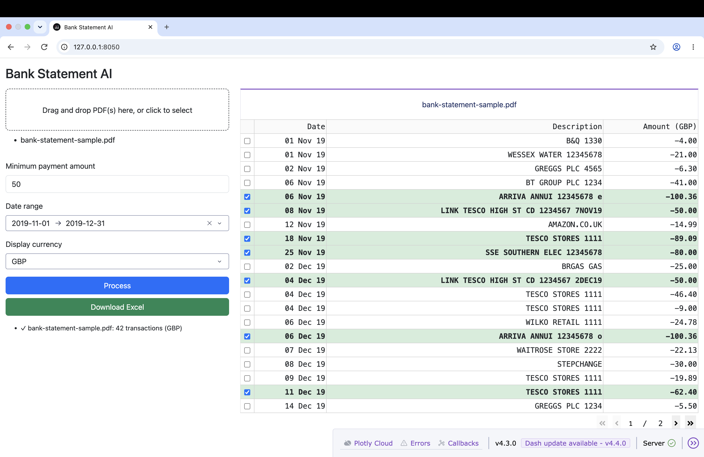

# Bank Statement AI

A human-in-the-loop bank statement analysis tool that extracts PDFs with different layouts and formats and turns them into standardised, structured data for easier analysis and comparison.


## Application Preview



## Pain Point

- One company. Multiple bank accounts. Different currencies. Hundreds of pages of transactions. 
- For Unrecorded Liabilities testing, auditors may need to go through every statement, find debit transactions one by one, convert amounts and decide which payments are large enough to test. The more accounts, currencies and transactions are involved, the easier it is to miss an item, use the wrong exchange rate, or select payments inconsistently.
- That is the problem this tool addresses: less manual review time, fewer human errors, more consistent results.


## Key Features

- **Multi-PDF upload** — drag and drop one or more bank statements at once
- **AI-powered extraction** — automatically reads transactions from different PDF layouts using OCR and Gemini
- **Debits only** — filters out credits so you only review payments out
- **Smart pre-selection** — rows above your minimum amount threshold are automatically ticked, so you only sense-check rather than select from scratch
- **Date range filter** — narrow the visible transactions to a specific period
- **Multi-currency support** — convert all amounts to a single currency using live exchange rates
- **Human-in-the-loop** — you stay in control; tick or untick any row before exporting
- **Excel export** — download selected transactions as a single `.xlsx` file, one sheet per statement


## Tech Stack

| Layer | Technology | Purpose |
|---|---|---|
| Web Interface | Dash | The browser UI — upload PDFs, set filters, review and download results |
| OCR | docTR | Reads text from each PDF page |
| AI Extraction | Gemini 2.5 Flash | Understands the text and picks out each transaction (date, amount, description, currency) |
| Data Validation | Pydantic | Ensures Gemini always returns data in the exact format the app expects |
| Currency Conversion | Frankfurter API | Converts amounts to your chosen currency using live exchange rates |
| Export | pandas + openpyxl | Saves the selected transactions into an Excel file |


## How It Works

```text
Bank Statement PDF
        │
        ▼
docTR OCR
        │  1. Renders each page into a pixel image
        │  2. Detection network — draws boxes around text regions
        │  3. Recognition network — reads text inside each box
        │  4. Drops low-confidence words
        ▼
Plain Text (newline-separated, one line per text line)
        │
        ▼
Gemini 2.5 Flash
        │  Reads the plain text via system prompt instructions
        │  Ignores headers, totals, and summary lines
        │  Returns validated structured JSON
        ▼
Structured Transactions
        │  ├── date        e.g. "06 Nov 19"
        │  ├── description e.g. "TESCO STORES"
        │  ├── amount      e.g. "-62.40" (negative = debit)
        │  └── currency    e.g. "GBP"
        │
        ▼
Filter & Display (Dash Web UI)
        │  Keeps debits only
        │  Filters by date range
        │  Pre-selects rows above threshold
        ▼
User Sense-Check (tick / untick rows)
        │
        ▼
Export (.xlsx) — checked rows only, one sheet per PDF
```

## Getting Started

### 1. Clone the repository

```bash
git clone https://github.com/Lanting687/bank_statement_ai.git
cd bank_statement_ai
```

### 2. Create a virtual environment and install dependencies

```bash
python -m venv .venv
source .venv/bin/activate        # Windows: .venv\Scripts\activate
pip install -r requirements.txt
```

### 3. Verify the setup

```bash
pytest tests/ -q
```

### 4. Get a Gemini API key


1. Go to [Google AI Studio](https://aistudio.google.com/app/apikey)
2. Click **Create API key**
3. Create a `.env` file in the project root and add your key:

```
GEMINI_API_KEY=your_key_here
```

### 5. Run the app

```bash
python app.py
```

Open [http://127.0.0.1:8050](http://127.0.0.1:8050) in your browser.

### 6. Use the app

1. Drag and drop one or more bank statement PDFs into the upload zone (sample statements are available in the `samples/` folder)
2. Set your **minimum payment amount** (rows above this will be pre-ticked)
3. Optionally set a **date range** and **display currency**
4. Click **Process** — the app runs OCR and Gemini extraction
5. Review the pre-selected transactions in the right panel — tick or untick as needed
6. Click **Download Excel** to export the selected rows


## Testing

```bash
pytest tests/ -q
```

Covers debit filtering, date range logic, currency conversion, and edge cases. No API key required.


## Responsible Use and Disclaimer

This is a portfolio prototype. AI-generated results must be reviewed and approved by the user before export.

PDF processing sends extracted transaction data to the Google Gemini API. Users should check their organisation’s data privacy and confidentiality requirements before using real bank statements.
