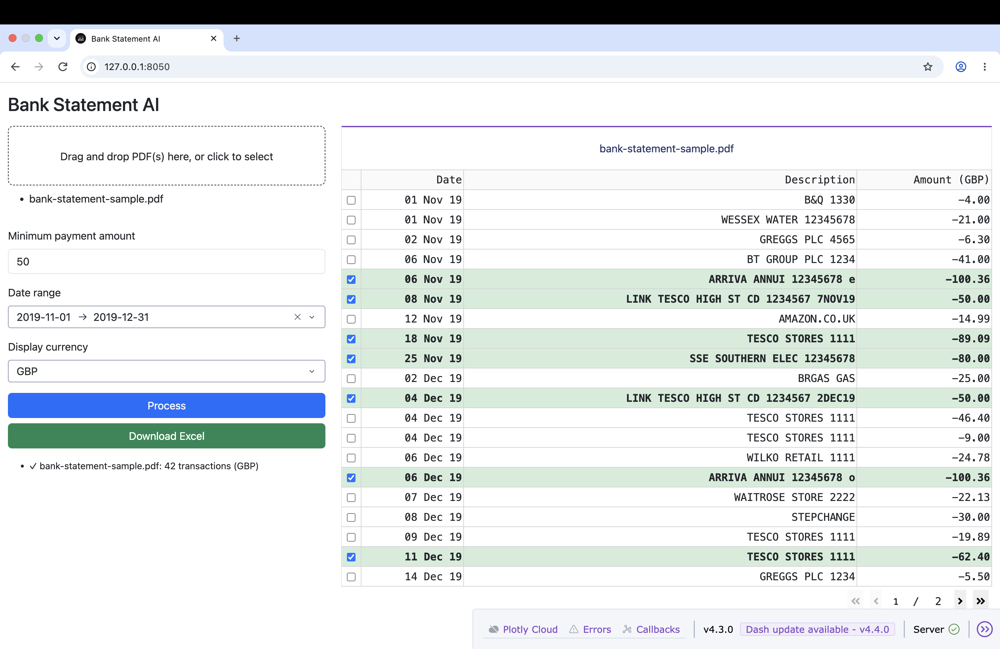
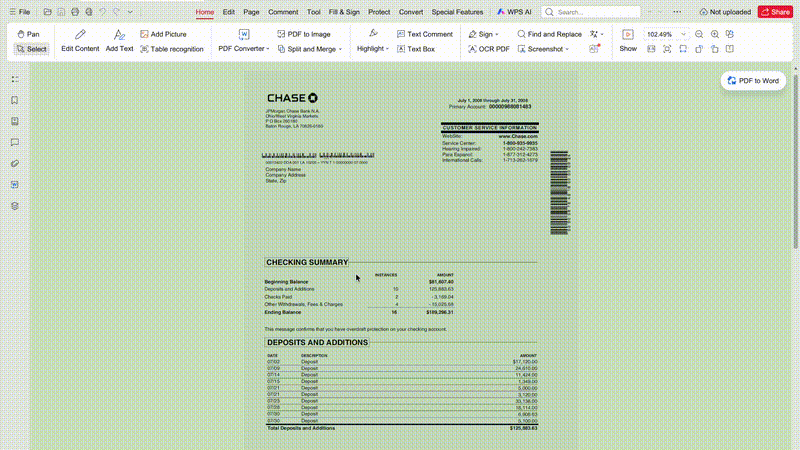

<div align="center">



# Bank Statement AI

**A human-in-the-loop tool that extract bank statements with different layouts and turns them into standardised and structured data for easier analysis and comparison.**


[Demo](#-demo) · [Pain Point](#-pain-point) · [Key Features](#-key-features) · [How It Works](#️-how-it-works) · [Getting Started](#-getting-started) · [Testing](#-testing) · [Documentation](#-documentation) · [Privacy](#-privacy) · [Disclaimer](#️-disclaimer)

</div>


## 🎬 Demo



[Watch the full video demo](docs/demo.mp4)

*(Recorded against the earlier Dash interface — the workflow shown is the same; the UI has since moved to Next.js, see below.)*


## 🎯 Pain Point

- One company. Multiple bank accounts. Different currencies. Hundreds of pages of transactions. 
- For Unrecorded Liabilities testing, auditors may need to go through every statement, find debit transactions one by one, convert amounts and decide which payments are large enough to test. The more accounts, currencies and transactions are involved, the easier it is to miss an item, use the wrong exchange rate, or select payments inconsistently.
- That is the problem this tool addresses: less manual review time, fewer human errors, more consistent results.


## ✨ Key Features

- **Multi-PDF upload** — drag and drop one or more bank statements at once
- **OCR review workspace** — before anything is sent to DeepSeek, see the original PDF page and the OCR-extracted text for it side by side, so you can catch OCR mistakes (misread amounts, dropped minus signs, wrong dates) up front
- **AI-powered extraction** — automatically reads transactions from different PDF layouts using OCR and DeepSeek
- **Debits only** — filters out credits so you only review payments out
- **Smart pre-selection** — rows above your minimum amount threshold are automatically ticked, so you only sense-check rather than select from scratch
- **Date range filter** — narrow the visible transactions to a specific period
- **Multi-currency support** — convert all amounts to a single currency using live exchange rates
- **Human-in-the-loop** — you stay in control; tick or untick any row before exporting
- **Excel export** — download selected transactions as a single `.xlsx` file, one sheet per statement
- **Modern, responsive UI** — Next.js + Tailwind CSS, built to actually feel like a tool rather than a prototype demo


## 🧰 Tech Stack

| Layer | Technology | Purpose |
|---|---|---|
| Frontend | Next.js (App Router, TypeScript) + Tailwind CSS | The browser UI — upload PDFs, review OCR, set filters, review and download results |
| PDF Rendering | pdf.js (`pdfjs-dist`), client-side | Renders each PDF page directly in the browser for the review panel — no server round-trip |
| Backend API | FastAPI | Serves the OCR/extraction/filtering pipeline over HTTP to the frontend |
| OCR | docTR | Reads text from each PDF page |
| AI Extraction | DeepSeek (`deepseek-v4-flash`) | Understands the text and picks out each transaction (date, amount, description, currency) |
| Data Validation | Pydantic | Backend request/response schemas, and ensures DeepSeek's JSON-mode reply always matches the exact format the app expects |
| Currency Conversion | Frankfurter API | Converts amounts to your chosen currency using live exchange rates |
| Export | pandas + openpyxl | Saves the selected transactions into an Excel file |

Bank Statement AI used to be a single Dash application (Python UI + backend
in one process). It's now a Next.js frontend talking to a FastAPI backend
— see `docs/ARCHITECTURE.md` for the full picture and why.


## ⚙️ How It Works

```text
Bank Statement PDF (uploaded via the Next.js app)
        │
        ▼
POST /api/documents  ──  validate + store (FastAPI backend)
        │
        ▼
POST /api/documents/{id}/ocr  ──  docTR OCR
        │  1. Renders each page into a pixel image
        │  2. Detection network — draws boxes around text regions
        │  3. Recognition network — reads text inside each box
        │  4. Drops low-confidence words
        ▼
Plain Text (kept page by page, cached server-side)
        │
        ▼
Review Workspace (Next.js)
        │  Original PDF page rendered client-side (pdf.js) and OCR text
        │  shown side by side; navigate page by page, per document
        │  Catches OCR errors before DeepSeek ever sees the text
        ▼
POST /api/documents/{id}/extract  ──  DeepSeek (deepseek-v4-flash)
        │  Reads the plain text via system prompt instructions
        │  Ignores headers, totals, and summary lines
        │  Returns validated structured JSON
        ▼
Structured Transactions
        │  ├── date        e.g. "06 Nov 19"
        │  ├── description e.g. "TESCO STORES"
        │  ├── amount      e.g. "-62.40" (negative = debit)
        │  └── currency    e.g. "GBP"
        │
        ▼
POST /api/transactions/compute  ──  Filter & Convert
        │  Keeps debits only
        │  Filters by date range
        │  Converts to your chosen display currency
        │  Pre-selects rows above threshold
        ▼
User Sense-Check (tick / untick rows in the Transactions tab)
        │
        ▼
POST /api/export/excel  ──  .xlsx, checked rows only, one sheet per PDF
```


## 🚀 Getting Started

The app now runs as two processes: the FastAPI backend and the Next.js
frontend. Run both, in two terminals.

### 1. Clone the repository

```bash
git clone https://github.com/Lanting687/bank_statement_ai.git
cd bank_statement_ai
```

### 2. Backend: create a virtual environment and install dependencies

```bash
python -m venv .venv
source .venv/bin/activate        # Windows: .venv\Scripts\activate
pip install -r requirements.txt
```

### 3. Verify the backend setup

```bash
pytest tests/ -q
```

### 4. Get a DeepSeek API key

1. Go to the [DeepSeek platform](https://platform.deepseek.com/) and create an API key.
2. Create a `.env` file in the project root and add it:

```
DEEPSEEK_API_KEY=your_key_here
DEEPSEEK_API_URL=https://api.deepseek.com/v1
```

### 5. Run the backend

```bash
uvicorn backend.main:app --reload --port 8000
```

Leave this running. It serves the API at `http://127.0.0.1:8000` (interactive
docs at `http://127.0.0.1:8000/docs`).

### 6. Frontend: install dependencies and run

In a second terminal:

```bash
cd frontend
npm install
npm run dev
```

Open [http://localhost:3000](http://localhost:3000) in your browser. The
frontend proxies `/api/*` requests to the backend automatically (see
`frontend/next.config.js`) — no separate configuration needed as long as
the backend is running on port 8000.

### 7. Use the app

1. Drag and drop one or more bank statement PDFs into the upload zone (sample statements are available in the `samples/` folder). OCR starts automatically per file.
2. In the **Review OCR** tab, pick a document from the sidebar list, and use **Previous** / **Next** to page through it, comparing the original PDF page (left) against the OCR text for that page (right).
3. Set your **minimum payment amount**, and optionally a **date range** and **display currency** in the sidebar.
4. Click **Extract Transactions** (sidebar, processes every OCR'd document) or **Continue to Extraction** (bottom of the Review OCR tab, for the current document) — either runs DeepSeek extraction and switches to the **Transactions** tab.
5. Review the pre-selected transactions — tick or untick as needed.
6. Click **Download Excel** to export the selected rows.

Re-running OCR or extraction never re-processes a document that's already
done — see `docs/ARCHITECTURE.md` for why.


## 🧪 Testing

Backend/pipeline tests:

```bash
pytest tests/ -q
```

Covers debit filtering, date-range logic, currency conversion, page-level
OCR result handling, PDF decode/validate/render logic, DeepSeek
request/response handling, and the FastAPI backend's routes (upload
validation, OCR/extraction idempotency, compute filtering, Excel export) —
all with mocked external services, generated-in-memory test PDFs, and no
committed sample data. No network calls or API keys are required.

There is no frontend automated test suite yet (see
`docs/CODING_STANDARDS.md` for what to consider before adding one).


## 📚 Documentation

- [`docs/ARCHITECTURE.md`](docs/ARCHITECTURE.md) — system overview, module responsibilities, data models, caching strategy, external dependencies, security, and error handling
- [`docs/PRODUCT_REQUIREMENTS.md`](docs/PRODUCT_REQUIREMENTS.md) — the problem this tool solves, user flow, and acceptance criteria
- [`docs/CODING_STANDARDS.md`](docs/CODING_STANDARDS.md) — conventions used in this codebase, Python and TypeScript
- [`CLAUDE.md`](CLAUDE.md) — instructions for AI coding agents working on this repo


## 🔒 Privacy

This is a prototype, not a hardened production system. A few things worth knowing before uploading real statements:

- PDF pages and OCR text are sent to the **DeepSeek API** as part of transaction extraction — check your organisation's data-handling policy before uploading real bank statements.
- Uploaded PDFs are not written to permanent storage: they exist in the browser's memory, in an auto-deleted temp file during OCR, and in the backend process's memory for the review workspace (cleared on restart) — see `docs/ARCHITECTURE.md` section 6 for the exact lifecycle.
- The backend keeps each visitor's documents separate using a session cookie (`bsai_session`, httpOnly, no personal data) — one visitor cannot see or affect another visitor's uploaded statements. This still runs as a single process (see `deploy/backend.service`), so it does not scale across multiple worker processes or horizontally — see `docs/ARCHITECTURE.md` section 4.
- Optional Google Analytics (standard page-view tracking only, opt-in via `NEXT_PUBLIC_GA_ID` — see `deploy/DEPLOY.md`) is added in `frontend/app/layout.tsx`. It never sees PDF, OCR, or transaction content — that data stays server-side (`backend/store.py`) and is never passed to the analytics script.


## ⚠️ Disclaimer

This is a portfolio prototype. AI-generated results must be reviewed and approved by the user before export.

PDF processing sends extracted transaction data to the DeepSeek API. Users should check their organisation's data privacy and confidentiality requirements before using real bank statements.
