# Architecture

This document describes the actual implementation of Bank Statement AI,
including the Next.js + FastAPI rearchitecture that replaced the original
Dash app. Read it before making further architectural changes — see
`CLAUDE.md`.

## 1. System Overview

Bank Statement AI now has three entry points, two of which share one
processing pipeline:

- **Next.js frontend** (`frontend/`) — the primary interface. Upload one or
  more PDFs, run OCR, review the OCR output against the original page
  (rendered client-side), extract transactions with DeepSeek, filter/select
  them, and export to Excel. Talks to the backend over HTTP; holds no
  business logic of its own beyond request orchestration and presentation.
- **FastAPI backend** (`backend/`) — a thin REST API wrapping the same
  `src/` pipeline the CLI uses. Owns all server-side state (uploaded PDF
  bytes, OCR results, extracted transactions) in `backend/store.py`.
- **CLI** (`src/cli.py`) — a single-file, non-interactive path: PDF in,
  filtered CSV/JSON out. Unaffected by this rearchitecture; still calls
  `src/pipeline.py` directly, no HTTP involved.
- **Shared pipeline** (`src/`) — OCR, LLM extraction, filtering, FX
  conversion, and export logic, used by both the backend and the CLI.

**The Dash app (`app.py`) has been retired.** It previously served as both
the frontend *and* the backend (Dash bundles a Flask server with its own
templating). Splitting the frontend into Next.js meant something else had
to serve `src/`'s pipeline over HTTP — that's what `backend/` is. `app.py`
still exists as a file (see the note at its top) only because of a
sandbox-specific inability to delete it during this change; it is not
imported or run by anything and should be deleted.

### Data flow

```mermaid
flowchart LR
    A[PDF Upload] --> B[POST /api/documents<br/>decode + validate<br/>src/pdf_review.py]
    B --> C[POST /api/documents/id/ocr<br/>docTR OCR<br/>src/ocr_advanced.py]
    C --> D[OCRResult: page 1..N<br/>src/models.py, cached in backend/store.py]
    D --> E[Review Workspace<br/>Next.js: PDF page rendered client-side with pdf.js<br/>+ OCR text panel, side by side]
    E -->|POST /api/documents/id/extract| F[DeepSeek Extraction<br/>src/llm_extract.py]
    F --> G[Pydantic Validation<br/>ExtractionResult]
    G --> H[Transaction dataclass<br/>src/parse.py]
    H --> I[POST /api/transactions/compute<br/>Filtering + FX Conversion<br/>src/filter.py, src/fx.py]
    I --> J[Human Transaction Review<br/>Next.js table, tick/untick rows]
    J --> K[POST /api/export/excel<br/>src/export.py-style xlsx build]
```



### Human review points

Unchanged from the OCR-review feature: two human-in-the-loop checkpoints.

1. **OCR review**: after OCR runs, the user compares each PDF page against
   the text docTR extracted from it, before that text is ever sent to
   DeepSeek.
2. **Transaction review**: after DeepSeek extraction, the user ticks/unticks
   pre-selected rows before exporting.

## 2. Module Responsibilities

### Backend (`backend/`, new)

| Module | Responsibility |
|---|---|
| `backend/main.py` | FastAPI app and every route. Routes are kept thin, mirroring the "keep Dash callbacks thin" rule from before: each route calls into `src/` (or `backend/store.py`) and shapes the result into a Pydantic response model — no OCR/extraction/filtering logic lives here directly. |
| `backend/store.py` | `DocumentStore` — the in-memory, process-lifetime home for every uploaded document's state (PDF bytes, OCR result, extraction, last computed rows). See section 4. |
| `backend/schemas.py` | Pydantic request/response models. Deliberately separate from `store.py`'s dataclasses: the store holds raw PDF bytes and full `Transaction`/`OCRResult` objects, which must never be serialized straight back to the client (see section 6); the schemas define exactly what the wire format is. |

### Frontend (`frontend/`, new — Next.js 14, App Router, TypeScript)

| Path | Responsibility |
|---|---|
| `frontend/app/page.tsx` | The single page. Owns all client-side orchestration state (which document is active, per-document review page, filters, row selections) and calls `lib/api.ts` for everything else. This is the closest analogue to the old `app.py`'s Dash callbacks, but as plain React state + `useEffect`, not a callback graph. |
| `frontend/lib/api.ts` | Typed `fetch` wrappers for every backend endpoint. The only place that knows the API's URL shape. |
| `frontend/lib/types.ts` | TypeScript interfaces mirroring `backend/schemas.py` by hand (see section 3 for why not generated). |
| `frontend/components/pdf-page-viewer.tsx` | Renders one PDF page client-side with `pdfjs-dist`. This is the biggest architectural change from the Dash version: `src/pdf_review.py`'s `render_page_png_base64()` used to run server-side and ship a PNG to the browser; now the browser renders the page itself from the original `File` object, and the backend never produces a preview image at all. See section 4 for the trade-off this introduces. |
| `frontend/components/review-workspace.tsx`, `transactions-table.tsx`, `filters-panel.tsx`, `document-list.tsx`, `upload-zone.tsx` | Presentational feature components — each corresponds to one region of the old Dash layout (review panels, transaction tables, the filter sidebar, the upload list). |
| `frontend/components/ui/*` | Small, hand-authored Tailwind-styled primitives (Button, Card, Badge, Tabs, Table, Select, Input, Alert, Spinner) in the shadcn/ui visual style. Not built on Radix UI or shadcn's CLI — see `docs/CODING_STANDARDS.md` for why, and what re-adding it later would involve. |

### Shared pipeline (`src/`, unchanged by this rearchitecture)

| Module | Responsibility |
|---|---|
| `src/cli.py` | Non-interactive entry point. Untouched: still calls `pipeline.extract_transactions()` and writes CSV/JSON via `src/export.py`. |
| `src/pdf_review.py` | Decodes/validates an uploaded PDF and computes page count / a stable content-hash id (`load_document`). Its image-rendering function (`render_page_png_base64`) is no longer called by anything in the running app now that rendering is client-side (section 4) — kept because `src/cli.py`-adjacent tooling and `tests/test_pdf_review.py` still exercise it, and because a server-rendered fallback is a plausible future need. |
| `src/models.py` | `OCRPage` / `OCRResult` — the page-aware OCR data model, unchanged. |
| `src/ocr_advanced.py` | Runs docTR OCR; unchanged. |
| `src/llm_extract.py` | Sends OCR text to DeepSeek via a plain HTTP POST (`requests`), JSON-mode output validated with Pydantic. Unchanged by this rearchitecture (already switched from Gemini to DeepSeek in a prior change). |
| `src/pipeline.py` | `run_ocr_only()` / `extract_statement_from_ocr()` (separable steps, used by `backend/main.py`) and `extract_statement()` / `extract_transactions()` (combined, used by the CLI). Unchanged. |
| `src/parse.py`, `src/filter.py`, `src/fx.py`, `src/export.py` | Unchanged. `backend/main.py` calls `src/filter.py` and `src/fx.py` directly in its `/api/transactions/compute` route, the same functions the old Dash `compute_and_render()` callback called. |

## 3. Data Models

`Transaction`, `OCRPage`/`OCRResult` are unchanged — see their docstrings in
`src/parse.py` / `src/models.py`.

**New: `backend/schemas.py` (wire format) vs. `frontend/lib/types.ts` (TS
mirror).** These two files describe the same shapes by hand, kept in sync
manually rather than generated from FastAPI's OpenAPI schema. That's a
deliberate prototype-scale trade-off: `fastapi`'s OpenAPI output plus a
generator (e.g. `openapi-typescript`) would remove the risk of the two
drifting apart, but adds a build step and a new dependency for a codebase
this size. If the API surface grows significantly, revisit this — see
"Suggested next iteration" in the project's change history.

**New: `backend/store.py`'s `DocumentState`** is the server-side
consolidation of what the Dash version split across `dcc.Store` (small
browser-held metadata) and module-level cache dicts in `app.py`. See
section 4.

## 4. State and Caching

This is the section that changed most. With a Next.js frontend there is no
`dcc.Store` equivalent — the frontend is stateless between HTTP requests —
so **all per-document state now lives server-side**, in
`backend/store.py`'s `DocumentStore`:

```python
class DocumentState:
    document_id: str
    filename: str
    pdf_bytes: bytes
    page_count: int
    ocr_status: str            # "pending" | "done" | "error"
    ocr_error: str | None
    ocr_result: OCRResult | None
    extraction: ExtractionState | None   # source_currency + transactions
    computed: ComputedState | None       # last /compute result, for export
```

The frontend keeps only small, ephemeral UI state in React (`useState`):
which document is active, which page it's showing, the current filter
values, and which row indices are ticked. None of that needs to survive a
page reload to keep the *data* safe — it all comes straight back from the
backend on the next request.

**The one exception, and the main trade-off of this rearchitecture:** the
original PDF's bytes, needed to render a preview page with `pdf.js`, live
only in the browser's `File` object from the `<input>`/drop event — see
`frontend/components/pdf-page-viewer.tsx`. Reloading the browser tab loses
that object (JS cannot silently re-read a file from disk), so a reload
mid-review shows a "re-upload to preview" state even though the OCR text
and any extraction are still sitting in `backend/store.py` and reappear
fine. The old Dash version didn't have this gap, because it rendered pages
to PNGs server-side and those PNGs were cached in `_PAGE_IMAGE_CACHE`,
independent of anything the browser held. This was a deliberate choice
(see the "PDF rendering" decision in this feature's change history) traded
for: no server-side image rendering/caching code at all, and crisper
zooming since `pdf.js` renders at the panel's actual pixel size instead of
a fixed server-chosen resolution.

**Cache keys, and why OCR/DeepSeek never re-run unnecessarily** are
unchanged in spirit from the Dash version, just enforced at the API layer
instead of in Dash callbacks:
- `document_id` is `sha256(pdf_bytes)[:16]` (`src/pdf_review.make_document_id`).
- `POST /api/documents/{id}/ocr` is idempotent: if `ocr_status == "done"`
  already, it returns the cached `OCRResult` without re-running docTR
  (`force=True` opts back in, not used by the frontend today).
- `POST /api/documents/{id}/extract` is idempotent the same way for
  DeepSeek, and the frontend also skips calling it at all for documents
  that already have `has_extraction: true`.
- Page navigation in the review workspace is a pure client-side state
  update (`reviewPageById` in `app/page.tsx`) plus a `pdf.js` re-render of
  an already-parsed document — it never calls the backend at all.

**Isolation between users/sessions:** `DocumentStore` is keyed by
`(session_id, document_id)`, not `document_id` alone. `backend/main.py`'s
`get_session_id()` dependency issues a random session id as an httpOnly
cookie the first time a browser hits any store-touching route, and every
route passes it straight through to `DocumentStore`. Before this, the
store was one flat process-global dict shared by every visitor: any
browser's `GET /api/documents` returned *every* document anyone had ever
uploaded to that running process, and any visitor could OCR, extract,
delete, or export any other visitor's document simply by knowing (or, more
directly, being handed via that same unfiltered list response) its
content-hash `document_id` — those ids were never secret or unguessable.
Two visitors uploading byte-identical files also used to silently
overwrite each other's state, since `document_id` alone (a content hash,
see `src/pdf_review.make_document_id`) was the entire key. The compound
key fixes both: distinct sessions never see each other's documents even
for identical file content, and `store.get()`/`store.all()` scoped to a
session id simply behave as if another session's documents don't exist.

This still does not extend across multiple worker processes or
horizontally-scaled instances — each would hold its own separate
in-memory `DocumentStore` with nothing shared between them, so a document
uploaded to one worker would 404 on a request that happens to land on
another. The current deploy (`deploy/backend.service`, plain
`uvicorn backend.main:app`, no `--workers` flag) runs a single worker, so
this doesn't bite today, but it's a ceiling on this approach, not
something the session cookie fixes. Scaling beyond one process would need
externally shared state (Redis, a database) — a decision to make
deliberately later, not a silent addition now (see `CLAUDE.md`, "Ask
before introducing").

## 5. External Dependencies

| Dependency | Used for | Failure / fallback behaviour |
|---|---|---|
| DeepSeek (`requests`, JSON mode) | Structured transaction extraction from OCR text | No fallback — extraction for that document fails; `backend/main.py`'s `/extract` route returns `502` with the error message, other documents are unaffected. Requires `DEEPSEEK_API_KEY`; `DEEPSEEK_API_URL` optionally overrides the default base URL. |
| Frankfurter API (`requests`, via `src/fx.py`) | Live FX conversion | Unchanged: `fx.convert()` returns the original amount with a warning string on any failure (1:1 fallback), surfaced to the frontend as `warning` on the relevant document in `/api/transactions/compute`'s response. |
| docTR (`python-doctr[torch]`) | OCR | Unchanged: no fallback: `run_ocr_only()` failures are caught in `backend/main.py`'s `/ocr` route and recorded as `ocr_status: "error"` rather than raised, so one document's OCR failure doesn't affect any other. |
| pypdfium2 | PDF page-count validation on upload (`src/pdf_review.load_document`), and indirectly (via docTR) rasterising pages for OCR | No longer used for browser-facing rendering — see section 4. Corrupt/empty/password-protected input still raises a typed `PDFReviewError` subclass on upload. |
| pdf.js (`pdfjs-dist`, frontend only) | Client-side PDF page rendering for the review panel | New in this rearchitecture. If a page fails to render (corrupt data slipping past the backend's validation, or a `pdf.js` internal error), `pdf-page-viewer.tsx` shows an inline error message rather than a blank panel. |

## 6. Security and Privacy

Mostly unchanged in substance, re-verified against the new split:

- **No permanent storage.** Uploaded PDF bytes exist as: (a) the browser's
  in-memory `File` object, (b) an HTTP request body in transit to the
  backend, (c) an OS temp file (`tempfile.NamedTemporaryFile`,
  auto-deleted) for the duration of the docTR call, and (d) the in-process
  `DocumentStore` in `backend/store.py`, cleared when the backend restarts.
  Nothing is written to a permanent or public directory.
- **No server filesystem paths reach the browser.** `document_id` is a
  content hash, never a path; the backend never returns a file path in any
  response.
- **PDF bytes never round-trip back to the browser.** `backend/schemas.py`'s
  response models deliberately have no field for raw PDF bytes — the only
  way the frontend "sees" the PDF is the copy it already has locally (the
  original `File` object), rendered by `pdf.js` in-browser.
- **Logs do not include statement content.** Backend route handlers log
  nothing beyond what `uvicorn`'s default access log records (method, path,
  status); application-level errors returned to the client are short,
  typed messages (see section 7), never transaction text or OCR output.
- **CORS is scoped, not wide open.** `backend/main.py` only allows
  `localhost:3000` / `127.0.0.1:3000` by default (the Next.js dev server),
  and in normal operation isn't even exercised: `frontend/next.config.js`
  proxies `/api/*` through Next.js itself, so requests from the browser are
  same-origin and CORS doesn't come into play at all. `allow_credentials=True`
  is set so the session cookie (see section 4) still works in the
  cross-origin fallback case this middleware exists for.
- **Session cookie is httpOnly.** The `bsai_session` cookie `get_session_id()`
  issues (section 4) can't be read or forged by client-side JS — it exists
  purely so the backend can tell visitors apart, carries no personal data,
  and isn't sent anywhere except this app's own backend.
- **API keys stay in environment variables** (`.env`, loaded via
  `python-dotenv` in `backend/main.py`, gitignored) — unchanged.
- See section 4 for how multi-user isolation now works and its remaining
  (single-worker) limit.

## 7. Error Handling

| Situation | Behaviour |
|---|---|
| Invalid / corrupt / empty PDF | `POST /api/documents` returns `422` with a plain-language `detail` message from `pdf_review.PDFReviewError`; the frontend shows it in the dismissible error banner. |
| Password-protected PDF | Same path as above — `pdf_review._open()` raises `PasswordProtectedPDFError`, surfaced as a `422`. |
| OCR failure (docTR/PyTorch exception, including docTR not installed) | `POST /api/documents/{id}/ocr` catches it (deliberately broad `except Exception` — docTR/PyTorch can raise types we can't enumerate), returns `200` with `ocr_status: "error"` and the message rather than a `5xx` — this is a per-document result, not a request failure. |
| Requesting OCR/extraction for an unknown `document_id` | `404`. |
| Extraction requested before OCR finished | `409`, with a message telling the caller to run OCR first. |
| DeepSeek failure / malformed response / schema-validation failure | `POST /api/documents/{id}/extract` catches it, returns `502` with the error message. |
| FX API failure | Unchanged: `fx.convert()`'s 1:1 fallback; surfaced as a non-fatal `warning` string per document in `/api/transactions/compute`'s response, not an error. |
| PDF page fails to render in the browser | `pdf-page-viewer.tsx` catches the `pdf.js` rejection and shows an inline message in the preview panel instead of a blank canvas. |
| Export failure | Not specifically handled beyond pandas/openpyxl's own exceptions bubbling up as a `500`; out of scope for this iteration, same as before. |

No raw Python traceback or stack trace is ever rendered in the frontend —
every path above converts exceptions into a short, typed message before it
reaches an HTTP response, and the frontend only ever displays `detail`
strings, never a raw response body.
